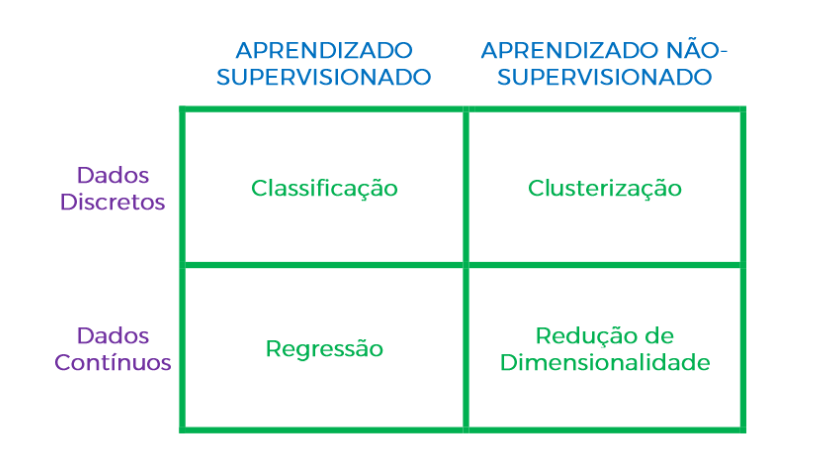

# Introdução à Machine Learning: Aprendizado Supervisionado e Não Supervisionado

## Capítulo 1: Conceitos Básicos de Machine Learning

Machine Learning (ML) é um campo da inteligência artificial (IA) que permite que sistemas aprendam e melhorem a partir da experiência sem serem explicitamente programados. ML utiliza algoritmos que processam dados para identificar padrões e tomar decisões baseadas nesses padrões.

### Tipos de Algoritmos de Machine Learning

Os algoritmos de ML são geralmente classificados em três categorias principais:

1. **Aprendizado Supervisionado**: O modelo é treinado com dados rotulados, ou seja, entradas com as saídas desejadas já conhecidas.
2. **Aprendizado Não Supervisionado**: O modelo é treinado com dados não rotulados e deve encontrar padrões ou estruturas dentro desses dados.
3. **Aprendizado por Reforço**: O modelo aprende a tomar decisões através de recompensas e penalidades, interagindo com um ambiente dinâmico.

## Capítulo 2: Aprendizado Supervisionado

O aprendizado supervisionado é uma abordagem do Machine Learning na qual os modelos são treinados com conjuntos de dados rotulados. Cada exemplo de entrada no conjunto de dados está associado a uma saída desejada, também conhecida como rótulo. Durante o treinamento, o modelo aprende a relação entre as entradas e os rótulos, permitindo fazer previsões precisas sobre novos dados.

### Características do Aprendizado Supervisionado

- **Utiliza conjuntos de dados rotulados**: Cada dado de entrada tem um rótulo correspondente que indica a saída desejada.
- **Objetivo**: Aprender uma função que mapeia as entradas para as saídas.

### Exemplos Comuns

- **Classificação**: Identificação de categorias a que um novo dado pertence (ex.: classificação de e-mails como spam ou não spam).
- **Regressão**: Previsão de valores contínuos (ex.: previsão de preços de imóveis).

### Aplicações do Aprendizado Supervisionado

- **Reconhecimento de padrões**: Identificação de padrões em dados, como reconhecimento de faces.
- **Diagnóstico médico**: Identificação de doenças a partir de dados de exames.
- **Previsão de mercado financeiro**: Previsão de preços de ações e tendências de mercado.
- **Reconhecimento de voz**: Conversão de fala em texto.
- **E muitos outros**.

## Capítulo 3: Aprendizado Não Supervisionado

O aprendizado não supervisionado é uma abordagem na qual os modelos são treinados com conjuntos de dados não rotulados. O objetivo é encontrar padrões intrínsecos nos dados, agrupá-los ou reduzir sua dimensionalidade sem a orientação de rótulos pré-definidos. Isso pode revelar insights valiosos sobre a estrutura subjacente dos dados.

### Características do Aprendizado Não Supervisionado

- **Utiliza conjuntos de dados não rotulados**: Não há rótulos disponíveis para os dados de entrada.
- **Objetivo**: Encontrar padrões ou estruturas nos dados.

### Exemplos Comuns

- **Clustering**: Agrupamento de dados em clusters com base em similaridades (ex.: segmentação de clientes).
- **Redução de dimensionalidade**: Simplificação de dados complexos em um formato mais gerenciável (ex.: compressão de imagens).

### Aplicações do Aprendizado Não Supervisionado

- **Segmentação de clientes**: Agrupamento de clientes com características semelhantes para estratégias de marketing direcionadas.
- **Análise de redes sociais**: Identificação de comunidades ou grupos dentro de redes sociais.
- **Análise de agrupamentos genéticos**: Agrupamento de dados genéticos para identificar padrões biológicos.
- **Análise de texto não estruturado**: Extração de temas ou tópicos a partir de grandes volumes de texto.
- **E muitos outros**.

## Capítulo 4: Comparação Entre Aprendizado Supervisionado e Não Supervisionado

### Semelhanças

- Ambos utilizam dados para treinar modelos.
- Ambos podem ser usados para identificar padrões nos dados.
- Ambos podem ser aplicados em diversos campos e indústrias.

### Diferenças

- **Rótulos**: O aprendizado supervisionado utiliza dados rotulados, enquanto o não supervisionado utiliza dados não rotulados.
- **Objetivo**: O aprendizado supervisionado busca prever rótulos para novos dados, enquanto o aprendizado não supervisionado busca encontrar padrões intrínsecos nos dados.

## Capítulo 5: Ferramentas e Bibliotecas Comuns em Machine Learning

Existem diversas ferramentas e bibliotecas que facilitam a implementação de algoritmos de Machine Learning. Algumas das mais populares incluem:

- **Scikit-learn**: Biblioteca de aprendizado de máquina para Python que oferece uma ampla gama de algoritmos de aprendizado supervisionado e não supervisionado.
- **TensorFlow**: Biblioteca de código aberto para computação numérica e aprendizado profundo.
- **Keras**: API de alto nível para redes neurais, escrita em Python e capaz de rodar em cima do TensorFlow.
- **PyTorch**: Biblioteca de aprendizado profundo que oferece flexibilidade e facilidade de uso.
- **Pandas**: Biblioteca para manipulação e análise de dados em Python.

## Conclusão

Machine Learning é um campo vasto e em constante evolução que oferece inúmeras oportunidades para inovação e melhoria em diversas áreas. O entendimento dos conceitos de aprendizado supervisionado e não supervisionado é fundamental para explorar todo o potencial desta tecnologia. Ao dominar essas técnicas, você estará preparado para aplicar Machine Learning a uma ampla gama de problemas e desafios.

### Livros Introdutórios sobre Machine Learning

1. **"Aprendizado de Máquina" por Flávio Codeço Coelho e André C. P. L. F. de Carvalho**
   - **Capítulo 1: Introdução ao Aprendizado de Máquina** - Visão geral do campo.
   - **Capítulo 4: Métodos de Classificação** - Abrange aprendizado supervisionado.
   - **Capítulo 7: Métodos de Agrupamento** - Introduz aprendizado não supervisionado.

2. **"Redes Neurais Artificiais para Engenharia e Ciências Aplicadas" por Osvaldo Cairo**
   - **Capítulo 2: Fundamentos das Redes Neurais** - Introdução ao aprendizado supervisionado.
   - **Capítulo 6: Aplicações das Redes Neurais** - Exemplos de uso, incluindo aprendizado não supervisionado.

3. **"Inteligência Artificial: Estruturas e Estratégias para a Complexidade Humana" por George F. Luger**
   - **Capítulo 13: Aprendizado** - Discussão sobre aprendizado supervisionado e não supervisionado.
   - **Capítulo 15: Técnicas de Aprendizado** - Métodos específicos de aprendizado não supervisionado.

### Vídeos no YouTube em Português

Aqui estão alguns vídeos no YouTube em português que fornecem introduções compreensíveis aos conceitos de aprendizado supervisionado e não supervisionado:

1. **"Supervisionado vs Não Supervisionado | Ciência de Dados na Prática #8" por Data Science Academy**
   - [Supervisionado vs Não Supervisionado](https://www.youtube.com/watch?v=QCMm_OlL8zI)
   - Explica as diferenças entre aprendizado supervisionado e não supervisionado de forma clara.

2. **"Machine Learning: Conceitos de Aprendizado Supervisionado e Não Supervisionado" por Universo Programado**
   - [Machine Learning: Conceitos de Aprendizado Supervisionado e Não Supervisionado](https://www.youtube.com/watch?v=aI1zjhY-xE0)
   - Uma introdução aos conceitos fundamentais de aprendizado supervisionado e não supervisionado.

3. **"Curso de Machine Learning - Aula 1: Introdução" por Curso em Vídeo**
   - [Curso de Machine Learning - Aula 1: Introdução](https://www.youtube.com/watch?v=zmZh1CzEz_0)
   - Curso introdutório cobrindo os conceitos básicos de Machine Learning, incluindo aprendizado supervisionado e não supervisionado.

